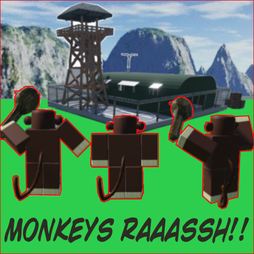
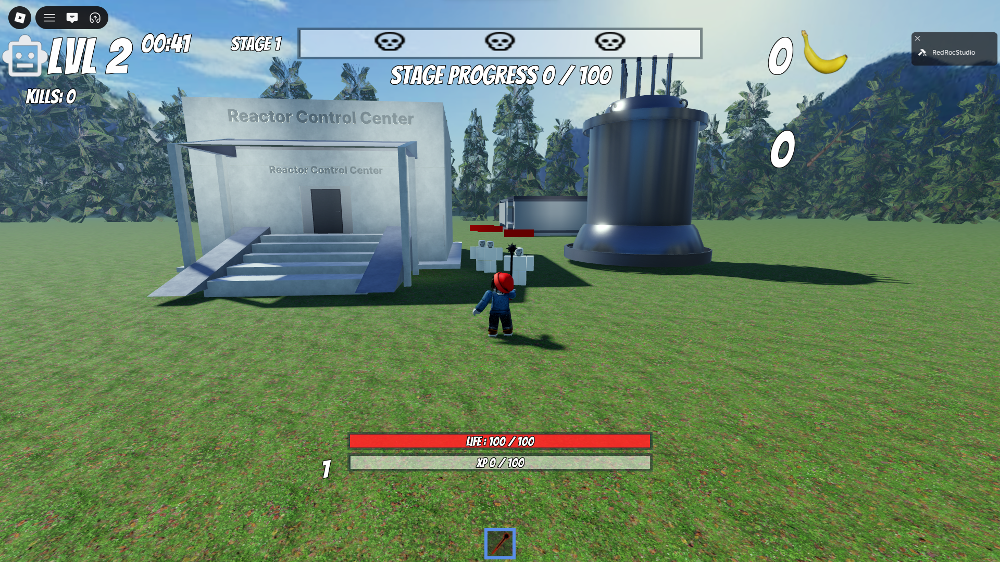
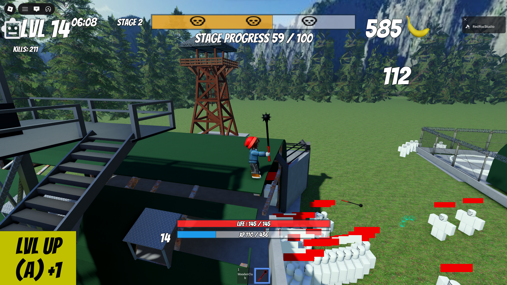

# Monkeys Raaassh

Roblox Multiplayer Survior Game 
-[Released on Roblox](https://www.roblox.com/games/95975992291805/Monkeys-Raaassh)

## Monkey Tribe Rush 2

-[Monkey Tribe Rush](https://github.com/BarbasOyun/MonkeyTribeRush) 
-Raaassh = Monkey Tribe Rush 2 

-Monkey Tribe Rush = Custom Architecture 
-Monkeys Raaassh use a new project Architecture = Knit, Roact and Rodux 

## Features

The project feature : 
-Procedural Map generation -> Node base (2D Collision Detection + Solving) 
-WIP ECS for performance and defining behaviors using composition 
-Object Pooling -> PoolService 
-Auto target + Auto attacks system 
-Weapons definition 
-Players Total Stats calculated from 2 "Power System" (Meta Upgrades + Augments) 

## Go Further

The Project still need some work : 
-Cleaning up the Project 
-Make Item, Weapons, Enemy Configuration easier 
-Proper Unit System 

Future Features : 
-Skill System 
-Status System 
-Enemies Modifier 
-Weapons Skins 

## Game Images

